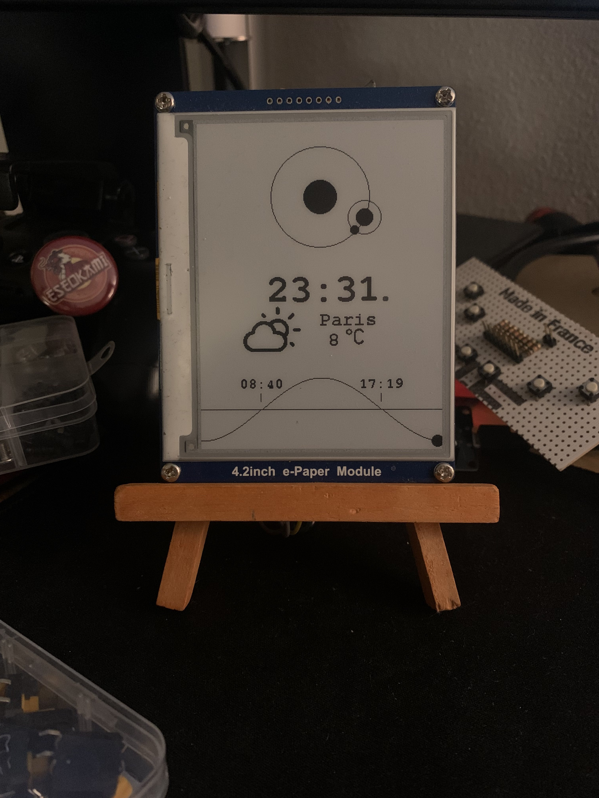

# Little DeskClock

Little clock to put on your desk,
Built with a e-paper display and an ESP32

This project was inspired by [dr-mod/little-sun-gazer](https://github.com/dr-mod/little-sun-gazer). With the goal of creating a lightweight version with an ESP32.



> This whole project is build in a "widget" like idea, where each widget is a class that can be added to the main loop. This way you can add new widgets by updating the internal data on a schedule, and create a new method in the screen to show it.

>This project is probably far from perfect, but it works for me. If you have any suggestions, please let me know! 
Or even better fork it and make a pull request.

## features
- It show the position of the earth and moon relative to the time of the year 
    *(not real position in space)*
- It shows the Time... wich is a good feature for a clock
- It shows the weather at your place
- It shows the time of sunrise and sunset, with a little animation throughout the day

## Reproduce :

You can totally reproduce this project for yourself ! 

#### <ins>Hardware :
- ESP32
- e-paper display
- the IDE arduino

*The e-paper display that i use is a GDEW042T2, you can find it from Good Display or waveshare.
it's not mandatory, but you'll propably need to tinker a bit if you choose another one.*

*You'll probably need some librairies, you can find them all in the arduino librairies manager.*

#### <ins>Software :

##### - <ins>Mandatory :
In the project you'll find a `config.h` file, you'll need to choose an weather api between the two supported by this project. Their is Meteo_concept and OpenWeatherMap.
they are both free, but OpenWeatherMap is worldwide, while Meteo_concept is only in France.

You'll need to create an account on the website of the api you choose, and get an api key. Then you'll need to put it in the `credential.h` file.

The 'credential.h' file is also where you need to put you wifi credentials.
This file is not in the repo, but you'll find a 'credential_template.h'. It should look like this :

```c
#ifndef __CREDENTIAL_H__
#define __CREDENTIAL_H__

typedef struct {
    char* ssid;
    char* password;
}Credential;

//It will go through this array to find the right wifi network
const Credential credentials[6] = {
    {"SSID_1","PASSWORD_1"},
    {"SSID_2","PASSWORD_2"},
    {"SSID_3","PASSWORD_3"},
    {"SSID_4","PASSWORD_4"}
};

//You need to configure wich api you're using in the "config.h"
#define WEATHER_TOKEN "YOUR_API_TOKEN"

#endif
```

##### - <ins>Optional :
You will also find all the widgets position in the `config.h` file. You can change them if you want.

You can also change the 
```c
#define PRECISON_CLOCK 5000 //in second
```
To change the precision of the clock. It's the time between each update of the clock.

## Bugs that i'm aware of :

- In production mode the e-paper display is not updating correctly.It show a character after the sunrise time. I'm not sure why, but it's working fine in debug mode. I don't know how to fix it, so if you have any idea, please let me know.
- The weather temperature using OpenWeatherMap showed a wrong value sometime for me, that partialy why i choose to implement Meteo_concept. I'll probably try to fix it in the future.
